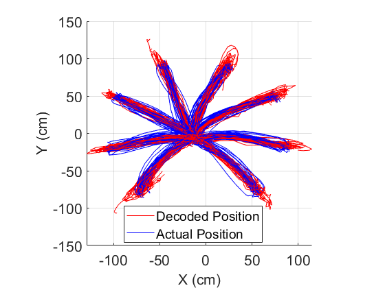

# NeuroDive - A Machine Learning system to decode a monkey’s arm movements from its neural activity

This code is a group coursework submitted as part of the Brain-Machine Interfaces module at Imperial College London.

---
### 🧐 How does it work?
The proposed neural decoder uses a 2-stage approach:
1. A classifier predicts the reaching angle for the current
trajectory.   Linear
Discriminant Analysis (LDA) is used for classification.
2. A linear regressor (trained on data
from the relevant reaching angle) predicts position.   Principal Component Analysis (PCA)
followed by Linear Regression (LR) is used for hand position
estimation – a technique called Principal Component
Regression (PCR)

---
### Task setup
Each colour represents a different reaching angle.

---
### Visualizing the results

---
### 💻 Usage

- positionEstimatorTraining.m: trains the model
- positionEstimator.m : predicts one hand position using the trained model
- testFunction_for_students_MTb.m: evaluates model performance on unseen test data
